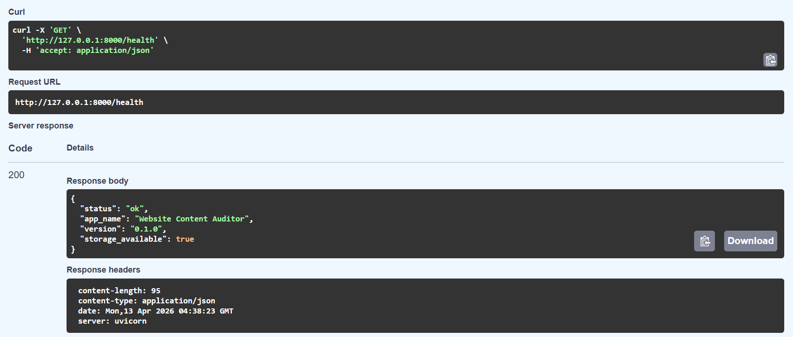
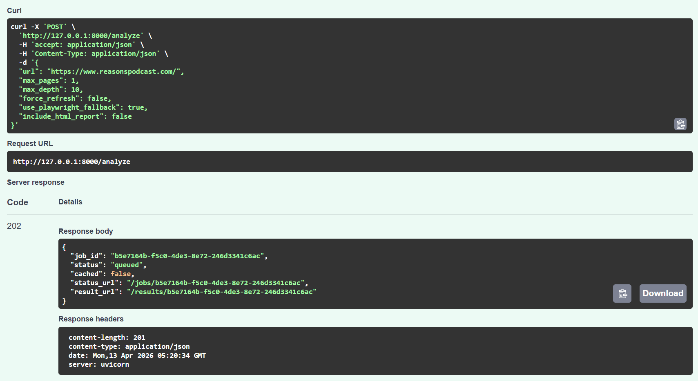
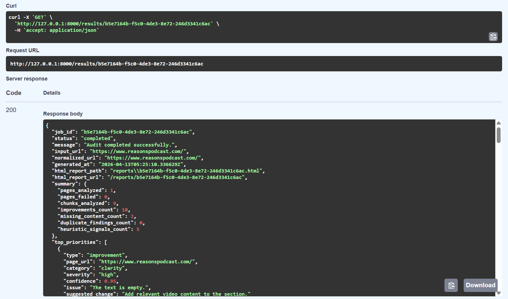
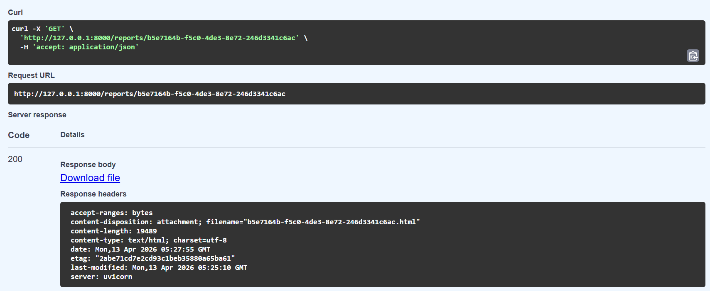

# Website Content Auditor

Website Content Auditor is a local-first FastAPI backend for analyzing website
content and generating structured improvement recommendations. It crawls
same-domain pages, extracts visible text, builds heading-aware sections, creates
analysis chunks, runs heuristic and similarity checks, analyzes content with a
local Ollama model, and returns page-grouped JSON results with an optional HTML
report.

## Quick Start

1. Create a virtual environment and install dependencies.
2. Copy `.env.example` to `.env`.
3. Start Ollama and pull `gemma3:4b`.
4. Run the API with `uvicorn app.main:app --reload`.
5. Open `http://127.0.0.1:8000/docs`.

For a fast smoke test, start with `https://example.com/`. For richer structured
content, try `https://docs.python.org/3/` or `https://fastapi.tiangolo.com/`.

## Screenshots

### Health Check



### Accepted Analysis Job



### Structured JSON Result



### Static HTML Report



## Features

- FastAPI API with job-based analysis flow.
- Same-domain crawling with URL normalization, filtering, and prioritization.
- Safe HTML fetching with `httpx`.
- Optional Playwright fallback for JavaScript-rendered or app-shell pages.
- Boilerplate-aware visible text extraction.
- Heading-aware section building.
- Section-aware chunking for local LLM analysis.
- Rule-based heuristic signals for thin content, weak CTAs, weak structure,
  vague wording, trust gaps, long paragraphs, and repetition.
- Local sentence-transformers embeddings for similarity retrieval.
- Cross-page duplicate and overlap detection.
- Local Ollama LLM provider, defaulting to `gemma3:4b`.
- Page-type-aware prompts for homepage, pricing, product/service, docs, FAQ,
  contact, about, blog, and generic pages.
- Strict Pydantic schemas for recommendations and results.
- JSON parsing, validation, bounded repair, and output quality guards.
- SQLite-backed jobs, result persistence, and cache entries.
- Priority scoring with `priority_score` and `why_prioritized`.
- Static HTML report generation with Jinja2.

## Architecture

```text
app/
├── api/          # FastAPI routes
├── analysis/     # chunking, heuristics, embeddings, prompts, LLM analysis, aggregation
├── crawler/      # URL normalization, filtering, discovery, fetching, extraction
├── jobs/         # job lifecycle and pipeline runner
├── models/       # Pydantic API and domain schemas
├── providers/    # LLM provider interface and Ollama implementation
├── reports/      # static HTML report rendering
├── storage/      # SQLite initialization and repository helpers
└── utils/        # shared text and logging utilities
```

Pipeline flow:

1. `POST /analyze` validates the request and creates or reuses a job.
2. The runner checks cache, crawls same-domain pages, and fetches HTML.
3. If browser fallback is enabled, weak or failed raw HTML pages are retried
   with Playwright.
4. Fetched HTML is converted into visible text and heading-aware sections.
5. Sections are split into analysis-ready chunks.
6. Heuristics and embeddings generate supporting signals and duplicate findings.
7. Ollama analyzes each chunk with page-type-aware prompt guidance.
8. Aggregation deduplicates findings, groups results by page, and ranks top
   priorities.
9. The final JSON result is saved in SQLite.
10. A static HTML report is generated when enabled or requested.

## Requirements

- Python 3.11+
- Ollama installed and running locally
- Ollama model pulled locally, default: `gemma3:4b`
- Internet access for the first sentence-transformers model download, unless
  the embedding model is already cached
- Optional: Playwright and Chromium for browser-rendered pages

First-time setup can take longer because local models, embedding dependencies,
and ML packages may need to be downloaded. Playwright is optional and adds a
Chromium browser installation step only when browser fallback is needed.

## Setup

### Windows PowerShell

```powershell
python -m venv .venv
.\.venv\Scripts\Activate.ps1
pip install -e ".[dev]"
copy .env.example .env
```

### macOS / Linux / WSL

```bash
python -m venv .venv
source .venv/bin/activate
pip install -e ".[dev]"
cp .env.example .env
```

## Ollama Setup

Install Ollama, then pull the default model:

```bash
ollama pull gemma3:4b
```

Start Ollama:

```bash
ollama serve
```

For lower-resource machines, set a smaller model in your private `.env`:

```env
OLLAMA_MODEL="qwen2.5:1.5b"
```

or:

```env
OLLAMA_MODEL="qwen2.5:0.5b"
```

If local generation times out, increase this value in `.env`:

```env
REQUEST_TIMEOUT_SECONDS=120
```

or:

```env
REQUEST_TIMEOUT_SECONDS=180
```

## Optional Playwright Fallback

The default crawler uses `httpx` first. Playwright is optional and only needed
for JavaScript-heavy pages where the raw HTML is empty or weak.

Install the browser extra:

```bash
pip install -e ".[dev,browser]"
```

Install Chromium:

```bash
playwright install chromium
```

Enable fallback globally in `.env`:

```env
ENABLE_PLAYWRIGHT_FALLBACK=true
```

Or enable it per request:

```json
"use_playwright_fallback": true
```

Keep `.env.example` conservative with:

```env
ENABLE_PLAYWRIGHT_FALLBACK=false
```

## Run The API

```bash
uvicorn app.main:app --reload
```

Interactive API docs:

```text
http://127.0.0.1:8000/docs
```

Health check:

```bash
curl http://127.0.0.1:8000/health
```

PowerShell:

```powershell
Invoke-RestMethod -Uri "http://127.0.0.1:8000/health"
```

## API Workflow

### Start An Audit

```bash
curl -X POST http://127.0.0.1:8000/analyze \
  -H "Content-Type: application/json" \
  -d '{
    "url": "https://example.com",
    "max_pages": 5,
    "max_depth": 2,
    "force_refresh": false,
    "use_playwright_fallback": false,
    "include_html_report": true
  }'
```

PowerShell:

```powershell
$body = @{
  url = "https://example.com"
  max_pages = 5
  max_depth = 2
  force_refresh = $false
  use_playwright_fallback = $false
  include_html_report = $true
} | ConvertTo-Json

Invoke-RestMethod `
  -Method Post `
  -Uri "http://127.0.0.1:8000/analyze" `
  -ContentType "application/json" `
  -Body $body
```

Response:

```json
{
  "job_id": "b2f6c6d7-...",
  "status": "queued",
  "cached": false,
  "status_url": "/jobs/b2f6c6d7-...",
  "result_url": "/results/b2f6c6d7-..."
}
```

### Check Job Status

```bash
curl http://127.0.0.1:8000/jobs/<job_id>
```

PowerShell:

```powershell
Invoke-RestMethod -Uri "http://127.0.0.1:8000/jobs/<job_id>"
```

### Fetch JSON Results

```bash
curl http://127.0.0.1:8000/results/<job_id>
```

PowerShell:

```powershell
Invoke-RestMethod -Uri "http://127.0.0.1:8000/results/<job_id>"
```

### Fetch HTML Report

```bash
curl http://127.0.0.1:8000/reports/<job_id> -o audit-report.html
```

PowerShell:

```powershell
Invoke-WebRequest `
  -Uri "http://127.0.0.1:8000/reports/<job_id>" `
  -OutFile "audit-report.html"
```

Open `audit-report.html` in a browser.

## Output

Final results include:

- job metadata and generated timestamp
- input URL and normalized URL
- site-level summary counts
- top priorities with `priority_score` and `why_prioritized`
- page-level grouped improvement recommendations
- page-level grouped missing-content recommendations
- duplicate and overlap warnings
- heuristic signal summaries
- failed pages and warning messages
- optional `html_report_path` and `html_report_url`

Improvement recommendations include:

- category
- page URL
- section metadata
- issue
- suggested change
- optional example text
- reason
- severity
- confidence
- evidence snippet

Missing-content recommendations include:

- page URL
- section metadata or recommended location
- missing content
- suggestion or outline
- reason
- priority
- confidence

## Caching

The cache key is derived from the normalized URL and important configuration:

- crawl limits
- Playwright fallback flag
- HTML report flag
- Ollama model
- embedding model
- pipeline version

If a valid cache entry exists and `force_refresh` is false, `POST /analyze`
returns the cached job instead of reprocessing the website.

Cache entries expire after:

```env
CACHE_TTL_HOURS=24
```

Use `force_refresh=true` to bypass cache for a request.

## Reports

HTML reports are generated for completed and partial jobs when either condition
is true:

- request body contains `"include_html_report": true`
- `.env` contains `ENABLE_HTML_REPORTS=true`

Reports are written to:

```text
reports/
```

The JSON result includes:

```json
{
  "html_report_path": "reports/<job_id>.html",
  "html_report_url": "/reports/<job_id>"
}
```

## Recommended Demo Flow

1. Start with `https://example.com/` for a quick smoke test.
2. Try `https://docs.python.org/3/` or `https://fastapi.tiangolo.com/` for
   richer structured content.
3. Use a blocked, invalid, or inaccessible site to verify graceful failure
   handling.

Additional URLs that are useful for local testing:

```text
https://screenrant.com/
https://www.reasonspodcast.com/
```

Some large media, gaming, paywalled, or heavily protected sites may block both
`httpx` and Playwright. In that case the job should fail gracefully with a clear
job state and error message.

## Reset Local State

Stop the API first with `Ctrl+C`.

Windows PowerShell:

```powershell
Remove-Item -Recurse -Force .\data -ErrorAction SilentlyContinue
Remove-Item -Recurse -Force .\reports -ErrorAction SilentlyContinue
Remove-Item -Force .\*-report.html -ErrorAction SilentlyContinue
```

macOS / Linux / WSL:

```bash
rm -rf data reports ./*-report.html
```

Restart the API:

```bash
uvicorn app.main:app --reload
```

SQLite tables are recreated automatically on startup.

## Development

Run tests:

```bash
pytest
```

Run linting:

```bash
ruff check .
```

Compile-check imports:

```bash
python -m compileall app tests
```

## Environment Variables

Common `.env` values:

```env
APP_NAME="Website Content Auditor"
APP_VERSION="0.1.0"
APP_DEBUG=false
SQLITE_DATABASE_PATH="data/auditor.db"
OLLAMA_BASE_URL="http://localhost:11434"
OLLAMA_MODEL="gemma3:4b"
EMBEDDING_MODEL="sentence-transformers/all-MiniLM-L6-v2"
REQUEST_TIMEOUT_SECONDS=60
DEFAULT_MAX_PAGES=8
DEFAULT_MAX_DEPTH=2
CACHE_TTL_HOURS=24
ENABLE_PLAYWRIGHT_FALLBACK=false
ENABLE_HTML_REPORTS=true
REPORTS_DIRECTORY="reports"
```

Local `.env` files, SQLite data, cache files, and generated reports should not
be committed.

## Troubleshooting

### Ollama Request Timed Out

Use a smaller local model or increase `REQUEST_TIMEOUT_SECONDS` in `.env`.

### No Accessible Pages With Extractable HTML Content

Common causes:

- invalid or unreachable URL
- bot protection
- paywall or login wall
- regional blocking
- JavaScript-rendered shell without Playwright fallback
- consent or anti-automation layer

Enable Playwright fallback for JS-heavy pages. For bot-protected sites, use a
different public URL or provide accessible page content through a future
HTML-input flow.

### Cached Result Returned

Set `force_refresh=true` in the request or delete the local `data/` directory.

### PowerShell JSON Issues With `curl`

Use `Invoke-RestMethod` with `ConvertTo-Json`, or use `curl.exe` with properly
escaped JSON. The PowerShell examples above avoid quoting problems.

## Assumptions

- Crawling is same-domain only.
- The system is intended for small to moderate websites.
- Ollama must be running locally for LLM-backed recommendations.
- Embeddings are generated locally with sentence-transformers.
- Similarity retrieval runs in memory.
- Playwright fallback is optional.

## Limitations

- Bot-protected, login-only, paywalled, or consent-heavy sites may return little
  or no usable content.
- Playwright fallback requires optional browser dependencies.
- The current job runner uses FastAPI background tasks, not a distributed queue.
- Similarity search does not use a vector database.
- LLM output quality depends on the selected local model and source page quality.
- Analysis is limited to the submitted site.

## Future Improvements

- Sitemap and robots.txt-aware discovery.
- User-provided HTML analysis endpoint.
- Browser session reuse for faster Playwright fallback.
- Report export bundles.
- Optional remote provider behind the existing provider interface.
